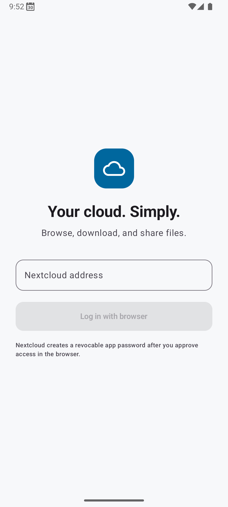
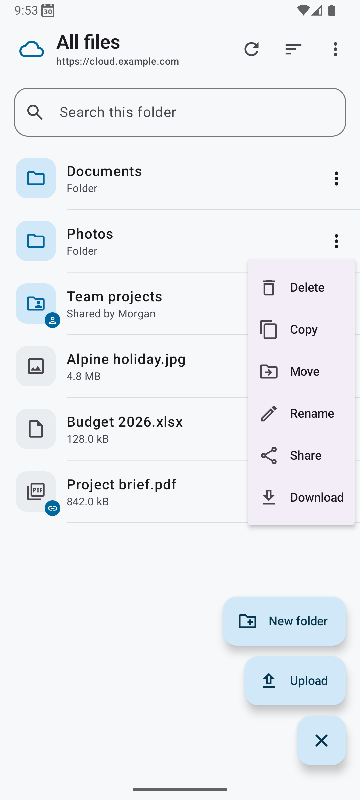
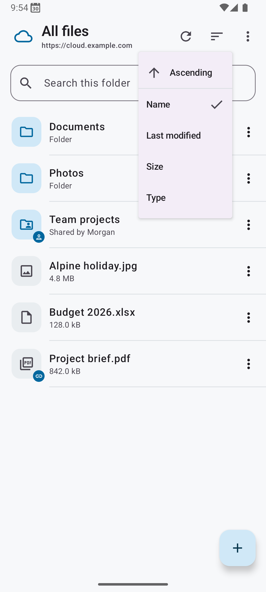
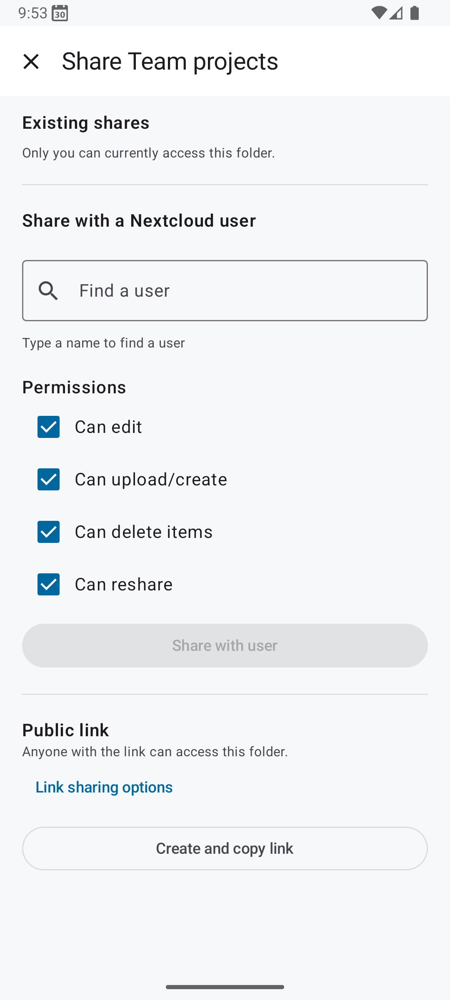

<div align="center">
  
</div>

<p align="center"><strong>Simple Nextcloud</strong></p>

A deliberately small Android Nextcloud client for minimal usability:

- Navigate the Nextcloud file system.
- Simple image viewer to quickly swipe through galleries.
- Upload and download files or folders.
- Move, copy, rename, or create files and folders.
- Share files with other users or public links.
- Register in Android as a share-target and as a file system to save files to or pick files from.

Most importantly for me, it distinguishes itself from the official Nextcloud client by _not storing all uploaded files in a duplicated, hidden cache_.

## Screenshots

<div align="center">
  
  
  
  
</div>

## Installation

Download and install the APK from the [Releases page](https://github.com/nielstron/simple_nextcloud/releases). You may have to click through a few scary screens that ask you whether you are installing malware (you are not).

## Build

```sh
./gradlew test assembleDebug
```

Open the project in Android Studio or install `app/build/outputs/apk/debug/app-debug.apk` on a device running Android 8 or newer.
